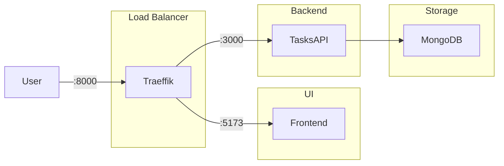

# ICT - Insanely Complex Todo

This repo contains a todo application, which is totally overengineered. It shows how to develop
and deploy a modern web application with several different services in the background.

## Services

- **[Frontend](./frontend/)** A simple Svelte client application.
- **[Tasks API](./backend/tasks/)** The API for interacting with tasks, written in Go, using the Fiber framework.

## Development Setup

The development setup is the first of several showcase architectures. It shows how to develop a frontend-backend application with different technologies using Docker and Docker Compose.

