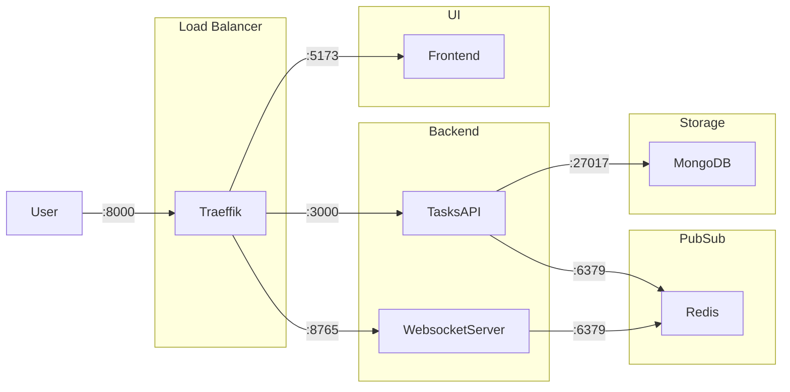

# ICT - Insanely Complex Todo

This repo contains a todo application, which is totally overengineered. It shows how to develop
and deploy a modern web application with several different services in the background.

## Components

This is an overview. You will find more detailed explanations for the components in their own Readme. The components are intentionally written in different languages and frameworks. First, we wanted to showcase the interactions between different kinds of applications, and second, we wanted to learn and have fun.

- **[Frontend](./frontend/)** A simple Svelte client application.
- **[Tasks API](./backend/tasks/)** The API for interacting with tasks, written in Go, using the Fiber framework. Changes to tasks are published as events to Redis.
- **[WebsocketServer](./backend/websocket-server/)** Listens for events in Redis and broadcasts them to all connected Websocket clients. The frontend connects to it by default.

## Services

- **Redis** is used as event queue for tasks. Whenever a task is added, updated or deleted, an event is published in Redis using [`PUBLISH`](https://redis.io/docs/latest/commands/publish/).
- **MongoDB** is used as database backend for tasks. We can later add alternatives, such as MariaDB or Postgres.

## Deployments

### Development Setup

The development setup is the first of several showcase architectures. It shows how to develop a frontend-backend application with different technologies using Docker and Docker Compose.

All apps run in development mode, if they have one. This means, any code changes should immediately be visible in the app. This setup allows fast feedback without the need for rebuilding Docker images and restarting services. It's also possible to run tests inside those containers or start dedicated development containers if you want to.

We've split the compose.yaml into several files to keep things tidy. Start with [compose.yaml](./compose.yaml). The other files are included at the top.

You can easily run this setup by checking out the repository and run the following commands:

```sh
docker-compose up -d
open http://localhost:8000
```



### Kubernetes with plain YML files

There is a plain YML Kubernetes setup. Have a look at the instructions in its [README](./k8s/README.md).
